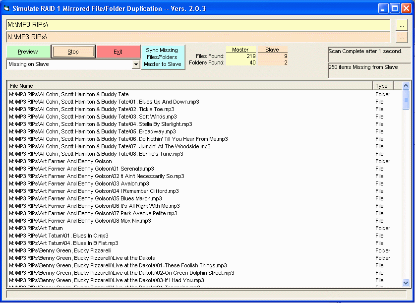



## Manual RAID 1  v2\.0\.11

### Description

This program simulates RAID 1 at the drive or any folder level. Updated to work far better than previously and command line driven operation now works. Next update, a small help file. RAID 1 is designed to mirror files from one drive to another. This goes it one better by allowing one to sync starting at any depth in a folder hierarchy. It can do any of the three sync operations separately or can do all three sequentially in one operation. Your choice. The three operations are: 1. Copy missing files from Master path to Slave path 2. Copy newer files (per modified date) from Master to Slave 3. Delete Orphaned files on the Slave drive. This three step process fulfills the basic tenants of RAID 1. This program runs fast. It was written because SyncToy (version 1 and 2) takes over 24 hours (never let it finish) just to find all of the files in a directory I have of about 900,000 files and leaves orphans (one drive had 5,000 of them). This program will survey the same directories in about 20 minutes. That's a significant improvement.

Try it and let me know what you think. It will go through some more testing and I am sure I will find things I want to tidy up and will reupload when I am completely happy with it. One thing added this time is a progress bar for overall progress. Nice would be a progress bar on large individual file copies. That brings along a bunch of other things that have to be done. Just takes time...

This was built on a nice program I found here but I have lost the reference to who wrote it. About 99% of the code has been replaced including all but one reference to FSO (because of speed issues) and that call is only to delete directories. The original code used recursion but now, it Does Not Use Recursion to find the files so you need not worry about running low on memory on that account. Between SyncToy taking over 24 hours to run and recursion running me out of memory, I had to write this to live! Enjoy and comment. It is a simple program for the most part and I would appreciate thoughts of what it could do or do better. There is a command line interface. A little work might need to be done there. Will be testing it. Note: Since this code can overwrite and delete files, please be careful until you trust it.

Wish list: Dual Threads if paths on separate physical disks but VB6 seems to hate threading.

Enjoy! Mike Morrow
 
### More Info
 
Two drives or folders to synchronize.

See code

Since this code can overwrite and delete files, please be careful until you trust it.

             |
---                |---
**Submitted On**   |2010-02-04 11:43:58
**By**             |[Mike Morrow](https://github.com/Planet-Source-Code/PSCIndex/blob/master/ByAuthor/mike-morrow.md)
**Level**          |Beginner
**User Rating**    |5.0 (15 globes from 3 users)
**Compatibility**  |VB 6\.0
**Category**       |[Complete Applications](https://github.com/Planet-Source-Code/PSCIndex/blob/master/ByCategory/complete-applications__1-27.md)
**World**          |[Visual Basic](https://github.com/Planet-Source-Code/PSCIndex/blob/master/ByWorld/visual-basic.md)
**Archive File**   |[Manual\_RAI217425242010\.zip](https://github.com/Planet-Source-Code/mike-morrow-manual-raid-1-v2-0-11__1-72826/archive/master.zip)

### API Declarations

See code

